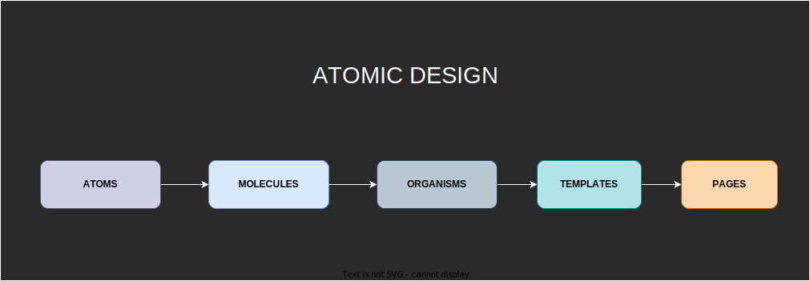
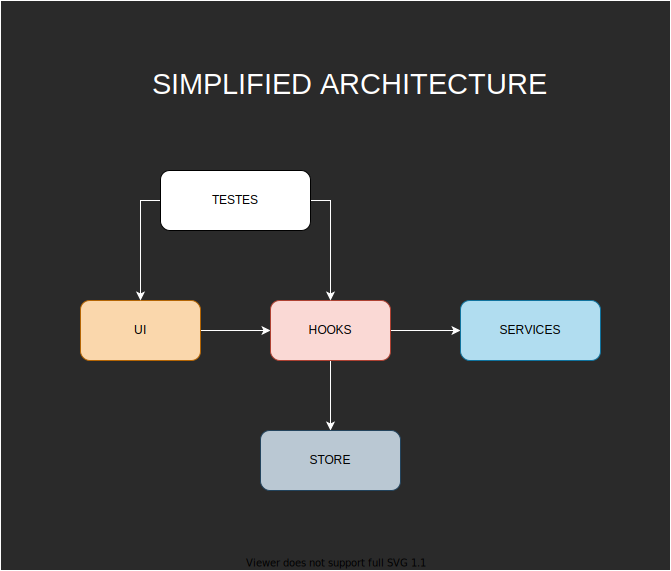
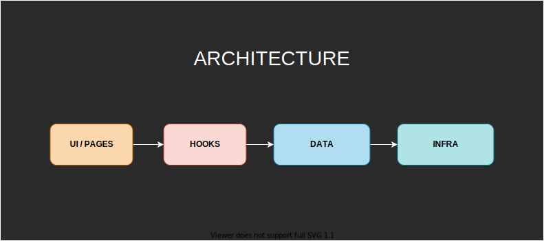

<div align="center">

  <a href="./LICENSE"></a>
  
  
</div>

<h1 align="center">Boilerplate Completo e atualizado com Next.js, Typescript Styled-Components, Testes, Redux Toolkit e PWA</h1>

<br />

# :memo: Sobre o Projeto

Esta aplicação é um boilerplate para sistemas complexos e de grande porte, especialmente os que precisam escalar com segurança e qualidade de código.

Além de constantemente atualizado, este projeto foi configurado nos mínimos detalhes para servir de base para projetos profissionais do mais alto nível de arquitetura e design de código.

<br />

<div align="center">
  
  
  <br />
  <br />
  
  
  
  <br />
  <br />
  
  
</div>

---

# :pushpin: Conteúdos

* [Tecnologias](#globe_with_meridians-tecnologias)
* [Features](#triangular_flag_on_post-features)
* [Pré-Requisitos](#white_check_mark-pré-requisitos)
* [Como instalar e executar o projeto](#question-como-instalar-e-executar-o-projeto)
  * [Clonar Repositório](#clonar-repositório)
  * [Instalar Dependências](#instalar-dependências)
  * [Inciar Ambiente de Desenvolvimento](#inciar-ambiente-de-desenvolvimento)
  * [Gerar Build de Produção](#gerar-build-de-produção)
  * [Inciar Ambiente de Produção](#inciar-ambiente-de-produção)
  * [Executar Testes](#executar-testes)
  * [Executar Testes em Modo Watch](#executar-testes-em-modo-watch)
  * [Inciar Storybook em Modo de Desenvolvimento](#inciar-storybook-em-modo-de-desenvolvimento)
  * [Gerar Build de Produção do Storybook](#gerar-build-de-produção-do-storybook)
  * [Executar lints](#executar-lints)
* [Autor](#technologist-autor)

<br />

---

# :globe_with_meridians: Tecnologias

⚛ Next.js

🔥 TypeScript

💅 Styled-Components

🗂 Redux Toolkit e Redux-Persist

🚩 Lints: ESlint, Prettier, EditorConfig, Commitlint e Typecheck

✅ Jest 

🐙 React Testing Library

📝 Storybook

📱 PWA

<br />

---

# :triangular_flag_on_post: Features

- [x] Projeto responsivo;

- [x] Atomic Design;

- [x] Acessível para navegação sem mouse e para leitores de tela;

- [x] Hooks personalizados para:
  - [x] animação na montagem e desmontagem de componentes;
  - [x] renderização condicional de componentes por breakpoints;

- [x] Tema criado com styled-componentes sem uso de provider e sem necessidade de acessar propriedades do tema com arrow functions;

- [x] Gerenciamento de estado global Redux Toolkit e pattern Slice, tudo desacoplado da ui do projeto;

- [x] Persistência de dados da Store;

- [x] 100% de cobertura nos testes contemplando: componentes, templates, páginas e hooks;
  
- [x] PWA;

<br />

---

# :white_check_mark: Pré-Requisitos

- node (última versão lts)

- yarn ou npm

<br />

---

# :question: Como instalar e executar o projeto

## Clonar Repositório

```bash
git clone https://github.com/everton-dgn/next_styled_components_redux_tlk_pwa_boilerplate.git
```

## Instalar Dependências

```bash
yarn
```

## Inciar Ambiente de Desenvolvimento

```bash
yarn dev
```

Disponível em http://localhost:3000

## Gerar Build de Produção

```bash
yarn build
```

## Inciar Ambiente de Produção

```bash
yarn start
```

Disponível em http://localhost:3000

## Executar Testes

```bash
yarn test
```

## Executar Testes em Modo Watch

```bash
yarn test:w
```

## Inciar Storybook em Modo de Desenvolvimento

```bash
yarn sb
```

Disponível em http://localhost:6006

## Gerar Build de Produção do Storybook

```bash
yarn build-sb
```

## Executar lints

```bash
yarn lint
```

```bash
yarn next:lint
```

```bash
yarn typecheck
```

<br />

---

# :technologist: Autor

Feito por [Éverton Toffanetto](https://programadordesucesso.com).

:link: LinkedIn: https://www.linkedin.com/in/everton-toffanetto

:link: YouTube: https://www.youtube.com/c/ProgramadordeSucesso

:link: Site: https://programadordesucesso.com
